# Introductory C Programming Specialization (Coursera/Duke)

### 7 Steps of Programming Process

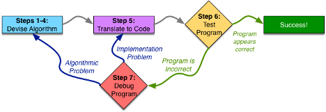

1. Work an Example Yourself
2. Write Down What You Just Did
3. Generalizing Values
4. Test Your Algorithm
5. Translate to Code
6. Test Program
7. Debug Program


---
### Coding Rules 

#### Variable
-  **Declaration:** `int myVariable;`
   - int: variable's type
   - myVariable: vairable's name
   - ends with semicolon
   - newly declared variable is uninitialized, meaning that its value is undefined
   - declare multiple variables: `int i, j, k;`

- **Assignment:** `myVariable = 3;` 
  - assigns a value 3 to the vairable myVariable

- **Declare and Assign:** `int x = 3;`

#### Function
```c
int myFunction (int x, int y){
   int z = x - 2*y;
   return z * x;
}
```
- Function basic component:
  - int: function's return type
  - myFunction: function's name
  - (int x, int y): function's parameter list
  - int x ... return z * x: function's body

- main 
Execution of a program starts at the start of **main**, and ends until **main** returns.

```c
int main(void){
   ...
   return 0;
}
```

#### Scope
The scope of a variable is the region of code in which it is visible. 

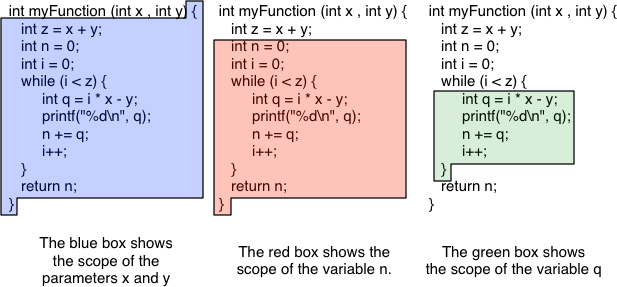
- Local variable: scope begins with its declaration and ends at the closing curly-brace }
- Function parameter: scope of the entire function.

#### Print
- printf stands for "formatted" 
```c
int x = 3;
int y = 4;
printf("x + y = %d", x + y);
```

- Printing redux


- Use sizeof to check variable's size
  ```
  printf("%d\n", sizeof(variable)); 
  ```

#### Scan
- Input a integer and assign to i : `scanf("%d, &i");`
  ```c
  #include <stdio.h>
  main() {
      int i;
      scanf("%d", &i);
      printf("%d\n", i);
  }
  ```


#### Conditional Statements
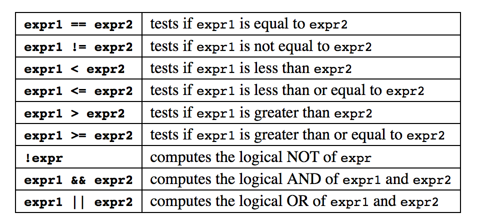 

- **if/ else**
```c
if (x == 3) {
   y = z + 1;
} else {
   z = x - 2;
   x = x + 1;
}
```
- Conditional expression: `(cond)? expr1 : expr2`
  If cond is true then expr1, else expr2
  ```c
  #include <stdio.h>
  
  main(void) {
	int i;
	int k;
	scanf("%d", &i);
	k = (i > 0)? i : -i;
	printf("%d\n", k);
    }
  ```

- **switch/ case**
when you are making a decision based on many possible numerical values of one expression
```c
switch (x - y) {
   case 0:
     y = 7;
     break;
   case 1:
     y = 9; // no break, so fall through
   case 2:
     z = 42;
     break;
   default: // default case
     n = 3;
     break;
}
```
- **Shorthand**
| Shrothand      |        Meaning |
| :------------- | -------------: |
| x += y;$~~~$   | x = x + y;$~~$ |
| x -= y;$~~~~$  | x = x - y;$~~$ |
| x *= y;$~~~~$  | x = x * y;$~~$ |
| x /= y;$~~~~~$ |  x = x / y;$~$ |
| x++;$~~~~~~~$  |  x = x + 1;$~$ |
| ++x;$~~~~~~~$  |  x = x + 1;$~$ |
| x--;$~~~~~~~~$ | x = x - 1;$~~$ |
| --x;$~~~~~~~~$ | x = x - 1;$~~$ |

#### Loops

- **While Loops**
```c
while (x < n) {
   y = y * x;
   x++;
}
```
- **Do/While Loops**
always want to do the body at least once
```c
do {
   y = y * x;
   x++;
} while (x < n);
```

- **For Loops**
repetition involves counting
```c
for (int i = 0; i < n; i++) {
   y = y * i;
}
```

- **Continue and Break**
`break`: calls for you to "stop" repeating things
`continue`: calls for you to skip the rest of the steps in the current repetition, and go back the start of the loop


#### Export Values:
When your algorithm knows the answer and has no more work to do, you should write a return statement, which returns the answer that you have computed.
- `return`


---
### Data Types

#### Basic Data Types
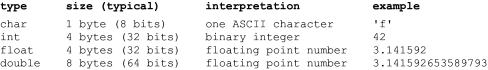 

- **char**
  most common used for 8 bits char are via American Standard Code of Information Interchagne (ASCII)
- **int**
  - Unsigned: 
   all positive. for 32 bits, values from 0 up to 4,294,967,295 (total 2^32 values)
  - Signedd: 
   have both negative and positve. 32 bits can express from  -2,147,483,648 to 2,147,483,647 (total 2^32 values)
  - Compute -5:
    1. flip the bits 5(0101) > (1010)
    2. add 1 > (1011)  
- **float and double**
  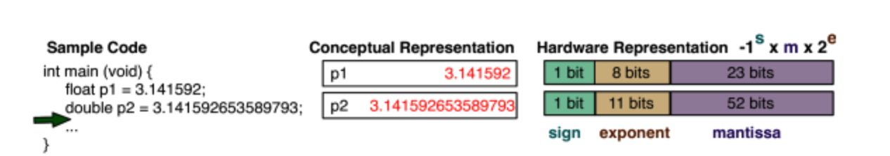

#### Non-numbers

- **String**
  a sequence of characters that ends with a special character called the null terminator '\0'
- **Images**
- **Sound and Video**
  
#### Complex, Custom Data Types

- **Struct** 
  Bundle multiple variables into a single entity. 

   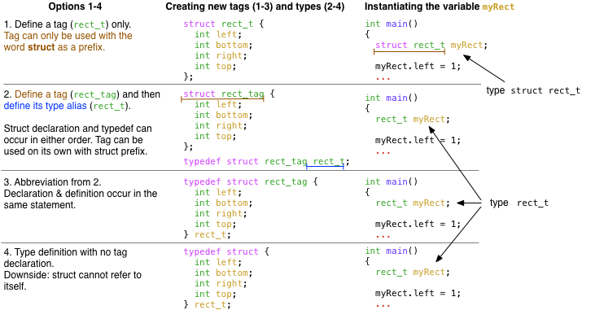

- **Typedef**
  - Used of structs
  - To define a new data type (helpful for abstraction)
  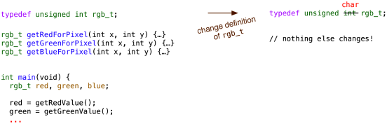

- **Enumerated Types**
  Useful when havin a data that need a set of values to label data order 
  ```c
  // Each level is assigned a constant value, starting with 0
  enum threat_level_t {
  LOW,
  GUARDED,
  ELEVATED,
  HIGH,
  SEVERE
  };

  // because enumerated types have integer values
  // they can be used as a simple value comparisons.
  void printThreat(enum threat_level_t threat){
  switch(threat) {
    case LOW:
      printf("Green/Low.\n"); 
      break;
    case GUARDED:
      printf("Blue/Guarded.\n"); 
      break;
    case ELEVATED:
      printf("Yellow/Elevated.\n"); 
      break;
    case HIGH:
      printf("Orange/High.\n"); 
      break;
    case SEVERE:
      printf("Red/Severe.\n");
      break;
      } 
  }

  void printShoes(enum threat_level_t currThreat) {
    if (currThreat >= ELEVATED) {
       printf("Please take off your shoes.\n”);
    }
    else {
       printf("Please leave your shoes on.\n”);
    }
  }

  int main(void) {
    enum threat_level_t myThreat = HIGH;
    printf("Current threat level is:\n");
    printThreat(myThreat);
    printShoes(myThreat);
    return 0;
    }
   ```


---
### Programming tool: 

#### Emacs
`emacs` filename: open filename in Emacs
`c-x c-f`: open a new file
`c-x 2`: split current window horizontally
`c-x b`: change to other(open) buffer
`c-x o`: move between split windows
`c-x c-s`: save file
`c-z`: suspend Emacs
`fg`: continue suspended job
`c-s`: incremental search forward
`c-r`: incremental search backward
`c-l`: redraw screen
`c-x u`: undo
`c-space`: set mark, highlight region
`c-a`: move to beginning of line
`c-e`: move to end of line
`c-k`: cut (kill in Emacs terminology) to end of line
`c-w`: cut(kill) region
`Esc-w`: copy region
`c-y`: paste (yank in Emacs terminology)
`Esc-y`: replace previous paste (yank) with earlier cut (kill)

`c-x (`: start the keyboard macro
`c-x )`: finish defining keyboard macro
`c-x e`: repeat macro one time
`e`: repeat macro

#### Getting Help: man Page 
Commands that provide built-in help: man command (short for “manual”)
`man -S3 printf` display the man page for the printf function from the C library

- **SYNOPSIS**
  lists the #include file to use, as well as the functions’ prototypes

- **DESCRIPTION**
  describes the behavior of the function in detail

- **Operate**
  Use "d" and "u" to scroll a page/ use "q" to quit/ "h" for help

#### Comparing
Comparing Output with diff in shell

``` shell
# check if file1 and file2 have differences
  diff file1 file2

# give a side by side out of differences
  diff -y file1 file        
```

----
### Compile
The act of translating the human-readable code that a programmer wrote (called “source code”) into a machine-executable format. 

Compile the code
```shell
# compile, produce a new file named hello
gcc -o hello -Wall -Werror -pedantic -std=g	
```

#### Compilation Process
high-level overview of the process that gcc goes through to compile the code

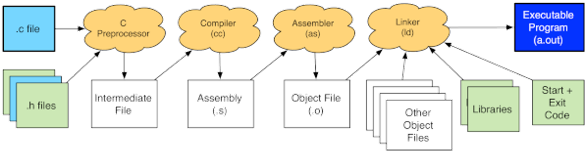

- light blue: code you have written
- light green:  represent built-in parts of C
- orange clouds: steps of this process (each is a separate program, but gcc invokes these programs for you) 
- white: intermediate files that gcc generates to pass information from one stage to the next
- dark blue: the final executable—the program that you can run to make your computer do whatever the program tells it to do

#### Preprocessing: 
Takes C source file and combines it with any header files that it includes, as well as expanding any macros that might have used. 

```c
#include <stdio.h>   // provides the prototype for printf
#include <stdlib.h>  // tells the preprocessor to define the symbol EXIT_SUCCESS to be 0 

int main (void) {
  printf ("Hello World\n");
  return EXIT_SUCCESS;
}
```
The preprocessor would transfrom above code into:
```c
int printf(const char *, ...);

int main (void) {
  printf ("Hello World\n");
  return 0;
}
```

**Header Files:**
  Primarily contain 3 things: function prototypes, macro definitions, type declaraitons
  - **function prototypes**: looks much like a function definition, except that it has a semicolon in place of the body.
  - **macro definitions**: 
    - Define a constant: `#define EXIT_SUCCESS 0`   
    - Define an arguemnt: `define SQUARE(x) x * x`
      (behave different from function arg, use it carfully)
  - **type declarations**: stdint.h defines types such as int32_t (which is guaranteed to be a 32-bit signed int on any platform)
  - Common convention:
    - `#include <stdio.h>`: standard C header
    - `#include "myHeader.h"`: customize header file

#### Compilation: 
Read the pre-processed source code —which has all the specified files included and all macro definitions expanded—and translate it into assembly. 

Assembly is the lowest level type of human readable code. In assembly, each statement corresponds to one machine instruction. 

#### Assembly:
Take the assembly that the compiler generated and assemble it into an object file. 

gcc invokes the assembler to translate the assembly instructions from the textual/human readable format into their numerical encodings that the processor can understand and execute.

#### Linking: 
Takes one or more object files and combines them together with various libraries, as well as some startup code, and produces the actual executable binary.


---
### make and Makefile
The make command reads Makefile which specifies how to compile your program. Specifically, it names the targets which can be made, their dependencies, and the rules to make the target.

#### Makefile specifies:
- structure
  ```
  Target: Dependencies
  [tab] Commands required to rebuild that target from the prerequisties
  ```
- **Target**: things to build
- **Dependencies**: inputs to build tragets from
- **Commands**: recipes to build a target from what it depends on
- When using Emacs to modify code: `c-c c-v`: compile from within Emacs

#### Example:
```makefile
myProgram: oneFile.o anotherFile.o
    gcc -o myProgram oneFile.o anotherFile.o
oneFile.o: oneFile.c oneHeader.h someHeader.h
    gcc -std=gnu99 -pedantic -Wall -c oneFile.c
anotherFile.o: anotherFile.c anotherHeader.h someHeader.h
    gcc -std=gnu99 -pedantic -Wall -c anotherFile.c
```

#### Upgrade Options
- **Variables**
  ```makefile
  CFLAGS=-std=gnu99 -pedantic -Wall
  myProgram: oneFile.o anotherFile.o
      gcc -o myProgram oneFile.o anotherFile.o
  oneFile.o: oneFile.c oneHeader.h someHeader.h
      gcc $(CFLAGS) -c oneFile.c
  anotherFile.o: anotherFile.c anotherHeader.h someHeader.h
      gcc $(CFLAGS) -c anotherFile.c
  ```

- **Clean**: intended to remove the compiled program, all object files, all editor backups (*.c~ *.h~), and any other files that you might consider to be cluttery
  ```makefile
  .PHONY: clean # Note: tells make that clean is a phony target
  clean:
      rm -f myProgram *.o *.c~ *.h~
  ```
 
- **Generic rules** 
  ```makefile
  CFLAGS=-std=gnu99 -pedantic -Wall
  myProgram: oneFile.o anotherFile.o
      gcc -o myProgram oneFile.o anotherFile.o
  %.o: %.c
      gcc $(CFLAGS) -c $<  # "$<" set to the name of the first prerequisite of the rule
  .PHONY: clean
  clean:
      rm -f myProgram *.o *.c~ *.h~
  oneFile.o: oneHeader.h someHeader.h
  anotherFile.o: anotherHeader.h someHeader.h
  ```
  Remark:  Convenient tool: makedepend 

- **Built-in generic rules**
  - Use `make -p` to see the built-in rules 
  - The built-in rules for building .o from .c:
      ```makefile
      %.o: %.c
      # commands to execute (built-in):
      $(COMPILE.c) $(OUTPUT_OPTION) $<
      ```
   - Definitions of COMPILE.c and OUTPUT_OPTION, (also included in make -p)
      ```makefile
      COMPILE.c = $(CC) $(CFLAGS) $(CPPFLAGS) $(TARGET_ARCH) -c
      OUTPUT_OPTION = -o $@
      ```
   - set the CC and CFLAGS by ourselves
      ```makefile
      CC = gcc
      CFLAGS = -std=gnu99 -pedantic -Wall
      myProgram: oneFile.o anotherFile.o
          gcc -o myProgram oneFile.o anotherFile.o
      .PHONY: clean depend
      clean:
          rm -f myProgram *.o *.c~ *.h~
      depend:
          makedepend anotherFile.c oneFile.c
      # DO NOT DELETE
      anotherFile.o: anotherHeader.h someHeader.h
      oneFile.o: oneHeader.h someHeader.h
      ```
   - When compile, the default rule will be:
    **gcc -std=gnu99 -pedantic -Wall -c -o something.o something.c**

- **Built-in Functions**
Use some of make’s built-in functions to automatically compute the set of .c files in the current directory, and then to generate the list of target object files from that list.  

   - Syntax: $(functionName arg1, arg2, arg3)
      ```makefile
      CC = gcc
      CFLAGS = -std=gnu99 -pedantic -Wall
      SRCS=$(wildcard *.c) # generate the list of .c files in the current directory
      OBJS=$(patsubst %.c,%.o,$(SRCS)) # to replace the .c endings with .o endings
      # use $(SRCS) and $(OBJS) in our Makefile
      myProgram: $(OBJS)
          gcc -o $@ $(OBJS)
      .PHONY: clean depend
      clean:
          rm -f myProgram *.o *.c~ *.h~
      depend:
          makedepend $(SRCS)
      # DO NOT DELETE
      anotherFile.o: anotherHeader.h someHeader.h
      oneFile.o: oneHeader.h someHeader.h
      ```

- **Debug version**
With no optimizations, and -ggdb3 to turn on debugging information
  ```makefile
  CC = gcc
  CFLAGS = -std=gnu99 -pedantic -Wall -O3
  DBGFLAGS = -std=gnu99 -pedantic -Wall -ggdb3 -DDEBUG
  SRCS=$(wildcard *.c)
  OBJS=$(patsubst %.c,%.o,$(SRCS))
  DBGOBJS=$(patsubst %.c,%.dbg.o,$(SRCS))
  .PHONY: clean depend all
  all: myProgram myProgram-debug
  myProgram: $(OBJS)
      gcc -o $@ -O3 $(OBJS)
  myProgram-debug: $(DBGOBJS)
      gcc -o $@ -ggdb3 $(DBGOBJS)
  %.dbg.o: %.c
      gcc $(DBGFLAGS) -c -o $@ $<
  clean:
      rm -f myProgram myProgram-debug *.o *.c~ *.h~
  depend:
      makedepend $(SRCS)
      makedepend -a -o .dbg.o  $(SRCS)
  # DO NOT DELETE
  anotherFile.o: anotherHeader.h someHeader.h
  oneFile.o: oneHeader.h someHeader.h
  ```

#### Compiler Options

- `-o`: specify the output file name: 
`gcc -o myProgram myProgram.c`

- `--std-gnu99`: specifies compiler use the C99 standard with GNU extensions

- `-Wall`: required to issue warnings for a wide range of questionable behavior
- `Werror`: treat all warnings as errors-making it refuse to compile the program until all warnings are fixed

- `-fsanitize=address`: extra checking to help detect a variety of problems at runtime

**Strongly recommend compiling with at least following warning options:**
`-Wall -Wsign-compare -Wwrite-strings -Wtype-limits -Werror`


---
### Testing

#### Test Coverage
There are 3 types of coverage, order from weak to strong as follow.

- Statement coverage
  Every statement in the function is executed
- Decision coverage
  All possible outcomes of decisions are exercised.
- Path coverage
  Test cases must span all possible valid paths through the control flow graph
  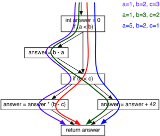


---
### Debugging

#### Tool
- Valgrind
  ```
  valgrind program_name
  ```
  - ask valgrind to remember where uninitialized values came from
    ```
    valgrind -track-origins=yes grogram_name
    ```
- GDB
 the GNU Project debugger, allows you to see what is going on `inside' another program while it executes -- or what another program was doing at the moment it crashed.

 1. Preparation: compile the code with debugging symbols
      - `-g`: gcc requests that it include debugging info.
      - `-ggdb3`: using gdb, request the maximum amount of degub info
  
 2. Run gdb inside Emacs: `M-x gdb`
   
    - `start`: begin execution, stop at main
    - `run`: restart program and execute until stopped
    - `step` (abbreviated `s`): execute one stop, going insdie function calls
    - `next` (abbreviated `n`): resume execution until line of code
    - `print` (abbreviated `p`): evaluate expressed and print the result
    - `display expr` (abbreviated `disp`): show value of expression whenever program stops
    - `continue` (abbreviated `c`): resume execution until stopped
    - `until`: Cause a loop to execute until it finishes    
    - `finish` (abbreviated `fin`): continue execution until current function returnsnext
    - `break function_name`: stop program when entering function_name
    - `clear function_name`: remove breakpoint previously set at function_name
    - Set breakpoint at Emacs: `c-x`
    - Conditional breakpoint: 
      - Make a breakpoint on line size: `break 7 if i==250000`
      - If the breakpoint already existed as breakpoint 1: `cond 1 i==250000`
    - Watchpoint, ability to have gdb stop when the value of a particular expression changes: `watch i` causes gdb to stop whenever the value of i changes
 3. Signals: whenever a program receives a signal, gdb will stop the program and give you control

     - SIGSEGV: segmentation fault
     - SIGABRT: happens when you program calls abort() or fails an assert
     - SIGINT: happens when the program is interrupted
---
### Operators

#### The priority of operators  
Priority order from high to low : 
- **( )** $~~~~~~~~~~~~~~~~~~~~$: left to right
- **- + ++ -- sizeof** : right to left (unary operators)
- **/ * %** $~~~~~~~~~~~~~~~$: left to right
- **+ -** $~~~~~~~~~~~~~~~~~~~$: left to right
- **< > <= >=** $~~~~~~~~~$: left to right
- **== !=** $~~~~~~~~~~~~~~~~$: left to right
- **=** $~~~~~~~~~~~~~~~~~~~~~~$: right to left

---
### Pointer
Pointer are way of referring to the **location** of a variable.

#### Pointer basics
```c
main()
{
  int x = 5;
  int *xPtr;  // Delcare a pointer to char

  // Initialization: 
  // sets the value of the variable xPtr to the address of x
  xPtr = &x;
  *xPtr = 6; // Dereferencing: changes the value that xPtr points to
  printf("x = %d", x);
}
```
- lvalue: 
  - simply variables (e.g., x or y)
  - if p is a pointer, then *p is an lvalue
- rvalue:
  - The right-hand side (the y in the statement x = y;)
  - the address of an lvalue (&x)
  - dereferencing a pointer (*p)

#### Line by Line interpretation
```c
// declare x and initiate value 3
int x = 3;
// declare variable p is of type integer pointer
int *p;
// initialize the value p of the address of x
// change the variable p to an arrow that point to x
p = &x;
// left-side: the value of p point to (variable x)
// right-side: set the value to 4
// >> x = 4
*p = 4;
// declare a variable y
// the value is initialized to the value p point to (4)
// >> create a new box named y and it the value 4
int y = *p;
// declare type integer pointer called q
// initial value of the address of y
// >> create new box called q, and have an arrow point to y
int *q = &y;
// left-side: store the value create into which q point to (namely the box of y)
// right-side: value to store is which p point to (4) plus 1  
// >> take the value p point to(4) and add 1, then store at location q point to (y)
*q = *p + 1;
// q receives value and value is the value p has
// >> an arrow that point to the p point to
q = p;
```

#### Swap
```c
void swap(int *x, int *y) {
  int temp = *x;
  *x = *y;
  *y = temp;
}

int main(void) {
  int a = 3;
  int b = 4;

  swap(&a, &b);
  printf("a = %d, b = %d\n", a, b);
  return EXIT_SUCCESS;
}
```

#### The mechanics of pointers
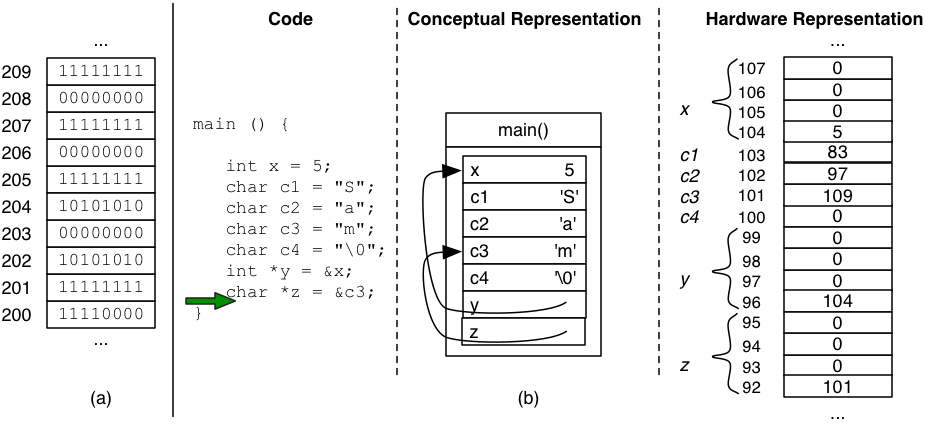  


---
### The Program's view of Memory
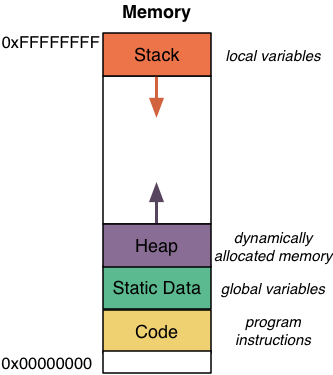

- **Code:** 
  The compiler converts the C code into object code and also assigns each encoded instruction a location in memory. These encoded program instructions live in the Code portion of memory, shown in yellow in the figure above.  

- **Static Data:**
  The static data area contains variables that are accessible for the entire run of the program (e.g. global variables). Unlike a variable that is declared inside a function and is no longer accessible when the function returns, static variables are accessible until the entire program terminates (hence, the term static )

- **Heap:**
  Stores dynamically allocated data

- **Stack:**
  Stores the local variables declared by each function

#### Pointers to Structs
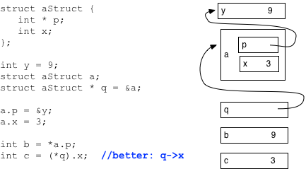

#### Pointers to pointers
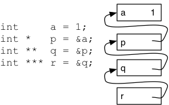

Above figure show 4 variables: 
- a: int
- p: int*
- q: int**
- r: int***
  - *r$~~~~$: q's box
  - **r$~~~$: p's box
  - ***r$~~$: a's box
- a's box: a, *p, **q, ***r


#### const
Specify that the compiler should not allow us to change the data
- Assign to x is illegal: 
  `const int x = 3;`
- Declared p as a pointer to a const int
  `const int * p = &x;` equal to
  `int const * p = &x;`
- *p can be changed, but not p itself
  `int * const p = &x;`
- Both pointer or the value can't change
  `const int * const p = &x;`

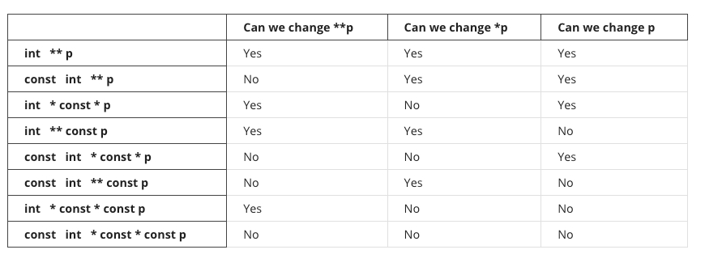


---
### Array
An array is a sequence of items of the same type (e.g., an array of ints is a sequence of ints). 

#### Declare and Initialize
- Declare an array of 4 ints called myArray: `int myArray[4];`

  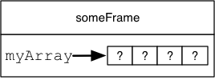

  - myArray: 
    - variable name
    - the pointer to the 4 boxes(first element) that make up the arrary
    - Unlike other variables, myArray is not an lvalue — we cannot change where it points
- Declare and initialize: `int myArray[4] = {42, 39, 16, 7}`
  - write too many elements: warining
  - to few elements: fill the remaining ones in w/ 0
- Omit the array size: `int myArray[] = {42, 39, 16. 7}`
  - compiler figures out [4]
- Initialize an array structs: declare and initialize an array of three points
  ```c
  point myPoints[] = {
    {.x = 3, .y = 4},
    {.x = 5, .y = 7},
    {.x = 9, .y = 2}
  }
  ```
- Create an array
  ```c
  #include <stdio.h>
  
  main() {
      int a[10];
      int i;
      for (i = 0; i < 10; i++){
          scanf("%d", &(a[i]));
      }
      for (i = 0; i < 10; i++){
          printf("%d\n", a[i]);
      }
  }
  ```

#### Array Access
- w/ pointer Arithmetic
  ```c
  int sumArray(int * array, int n){
    int answer = 0;
    int * ptr = array;
    for (int i; i < n; i++){
     answer += ptr*;
     ptr++;
    }
    return answer;
  }
  
  int main(void){
    int data[4] = {4, 6, 8, 3};
    int sum = sumArray(data, 4);
    printf("%d\n", sum);
    return EXIT_SUCCESS;
  }
  ```
- w/ Pointer Indexing
  ```c
  int sumArray(int * array, int n){
    int answer = 0;
    for (i = 0; i < n; i++){
      answer += array[i];
    }
    return answer;
  }

  int main(void){
    int data[4] = {4, 6, 8, 3};
    int sum = sumArrary(data, 4);
    printf("%d\n", sum);
    return EXIT_SUCCESS;
  }
  ```
  
#### Passing Arrays as Parameters
- Pass a pointer to the array and integer specify size
  ```c
  int myFunction(int * myArray, int size) {
  // whatever code...
  }
  ```
- Pass an array with the square bracket syntax
  ```c
  int myFunction(int myArray[], int size) {
  // whatever code...
  }
  ```

#### Array Size
- **size_t**: unsigned int with the right number of bits to describe the size or index of an array.
- **sizeof():** sizeof(double) or sizeof(*p)
 the compiler figures out the type of that expression, and evaluates the size of that type. 


---
### String

#### String Literals
A variable which points to a string literal
`const char * str = "Hello World\n";`

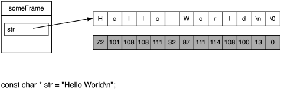
- str is a pointer, pointing at an array of characters.
- characters appear in the order of the string
- followed by the null terminator character, '\0' 

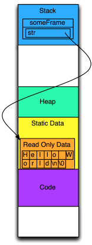
- string literal is stored into a read only portion of statics data section 
  > omit **const** and try to modify the string, the program will crash with a segmentation fault.
- The compiler puts the string literals into a read only region of memory because the literal may get reused, and thus should not be changed
  ```c
  char * str1 = "Hello";
  str1[0] = 'J';  // this would crash, but suppose it did not
  …
  …
  char * str2 = "Hello";
  printf("%s\n", str2);
  ```
  - str1 and str2 point at the same memory
  - if modification is allowed, str2 would print "Jello"

#### Mutable String
When we want to modify a string, we need the string to reside in writeable memory, such as the frame of a function or memory that is dynamically allocated by malloc. To make space for a string in a function’s frame, we need to declare an array of chars with sufficient space to hold all of its characters, plus its null terminator.

- Following three codes behave the same result:
  ```c
  // method 1
  char str[] = "Hello World\n";

  // method 2
  char str[] = {'H', 'e', 'l', 'l', 'o', ' ',
              'W', 'o', 'r', 'l'  'd', '\n', '\0'};

  // method 3
  char str[13];
  str[0]  = 'H';
  str[1]  = 'e';
  str[2]  = 'l';
  str[3]  = 'l';
  str[4]  = 'o';
  str[5]  = ' ';
  str[6]  = 'W';
  str[7]  = 'o';
  str[8]  = 'r';
  str[9]  = 'l';
  str[10] = 'd';
  str[11] = '\n';
  str[12] = '\0';
  ```
- Difference between **const char * str** and **char str[]**
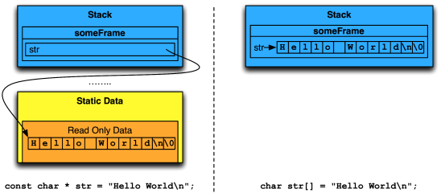

- Note: declare the array str must save enough space for null terminator **'\0'**, or it may cause some unexpected error.

#### Compare Two Strings
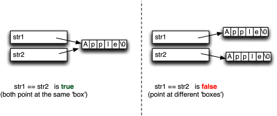

- Compare one by one
  ```c
  int stringEqual(const * str1, const * str2){
    const char * p1 = str1;
    const char * p2 = str2;

    while (*p1 == *p2){
      if (*p1 == '\0') {
        return 1;
      }
      p1++;
      p2++;
    }
    return 0;
  }
  ```
- Function of <string.h> : strcmp

#### String Copying
`str1 = str2`: both str1 and str2 point at the same memory location, but not copy a new string to str1
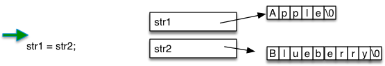
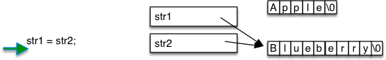

- Iterate through the characters of string and copy one by one
  ```c

  ``` 
- strncpy(): parameter (n) telling the maximum number of characters it is allowed to copy.
- strcpy(): more dangerous, no way to tell it how much space is available in the destination


---
### Multidimensional Arrays

#### Declaration
Declare a 2-dimentional array of double that is 4 elements by 3 elements, results in an array with four elements, and each of the elements of myMatrix is an array of 3 doubles.
`double myMatrix[4][3];`


#### Indexing
- myArray[2][1]:
  - evaluate myArray[2], obtaining a pointer to the 3-element array which is the 2nd element of myArray. 
  - it will index that array (which is an array of doubles), and evaluate to a double.
  -  myArray[2][1] is an lvalue
  -  Note: myArray[2] is not a lvalue (so as myArray)
    The pointer that myArray[2] evaluates to is not actually stored anywhere, it is just calculated by pointer arithmetic from myArray.

#### Initializing
```c
double myMatrix[4][3] = { 
  {1.0, 2.5, 3.2}, //elements of myMatrix[0]
  {7.9, 1.2, 9.9}, //elements of myMatrix[1]
  {8.8, 3.4, 0.0}, //elements of myMatrix[2]
  {4.5, 9.2, 1.6}  //elements of myMatrix[3]
  }; 
```
- We can leave off the first dimension's size, but may not elide any other dimension’s size.
  ```c
  //also legal: removed the 4 from the []
  double myMatrix[][3] = { 
    {1.0, 2.5, 3.2},    //elements of myMatrix[0]
    {7.9, 1.2, 9.9},    //elements of myMatrix[1]
    {8.8, 3.4, 0.0},    //elements of myMatrix[2]
    {4.5, 9.2, 1.6} };  //elements of myMatrix[3]
  ```
- A multidimensional array is not limited to two dimensions
  ```c
  int x[4][2][7]; // x is a 3D array, with 4 elements, each of which is
                  // an array with 2 elements
                  // (whose elements are 7-element arrays of ints)
  char s[88][99][122][44]; //s is a 4D array of chars: 88 x 99 x 122 x 44.
  ```

#### Array of pointers
We can also represent multidimensional data with arrays that explicitly hold pointers to other arrays
```c
double row0[3];
double row1[3];
double row2[3];
double row3[3];
double * myMatrix[4] = {row0, row1, row2, row3};
```


Storing the pointers to the rows of the matrix allow us to do thing we cannot do with the first representation

- We are not constrained to having each row be the same size as the other rows. 
- In the array of pointers representation, myMatrix [i] is an lvalue (recall that it is not if we just declare an array with multiple dimensions). Accordingly, we can change where the pointers point if we so desire. 
- We can have two rows point at the exact same array (aliasing each other).

#### Array of Strings

Consider the following two statements, each of which declares a multidimensional array of chars, and initializes it with a braced array of string literals:
```c
char strs[3][4] = {"Abc", "def", "ghi"};
char chrs[3][3] = {"Abc", "def", "ghi"};
``` 

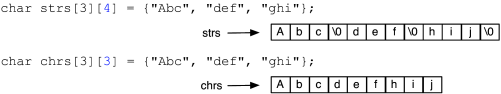

- (declares strs) includes space for the null terminator, which is required to make the sequence of characters a valid string. 
   
- (declares chrs) does not include such space and only stores the characters that were written (with no null terminator).
  - is correct if (and only if) we intend to use chrs only as a multidimensional array of characters  

##### different size of strings
Representing multidimensional data with an array of pointers allows us to have items of different lengths 

`const char * words[] = {"A", "cat", "likes", "sleeping."};` 

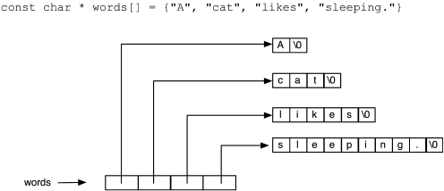

##### Use NULL as an indicater to check for the loop end

```c
const char * words2[] = {"A", "cat", "likes", "sleeping.", NULL};

const char ** ptr = words2;
while (*ptr != NULL) {
  printf("%s ", *ptr);
  ptr++;
}
printf("\n");
```


---
### Function Pointers

The difference of these code is *what* they do to each element. 

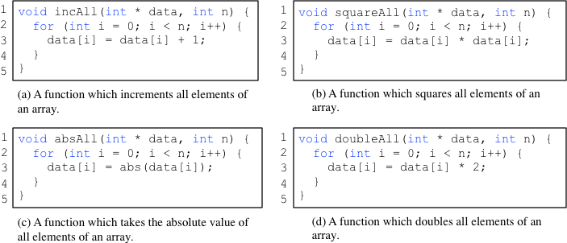

Pass in a function pointer for the parameter to specify what to do.

```c
void doToAll(int * data, int n, int (*f)(int)) {
  for (int i = 0; i < n; i++) {
    data[i] = f(data[i]);
  }
}
```
- **int (*f) (int)**: 
  declares a parameter (called f), whose type is “a pointer to a function which takes an int as a parameter, and returns a int.”

Use **typedef** with function pointers.

```c
typedef int (*int_function_t) (int);

void doToAll (int * data, int n, int_function_t f){
  for (int i = 0; i < n; i++){
    data[i] = f(data[i]);
  }
}
```

Pass in a pointer to any function of the appropriate type (i.e., one that takes an int and returns an int). 

```c
int inc(int x) {
  return x + 1;
}
int square(int x) {
  return x * x;
}
…
doToAll(array1, n1, inc);
…
doToAll(array2, n2, square);
…
```
- We will note that you may see such things written with the address-of operator, such as doToAll (array1, n1, &inc). This syntax is legal, but the & is superfluous, just as it is with the name of an array—the name of the function is already a pointer. 


---
### Recursion
Algorithm calls itself with different parameter values. 

```c
int factorial (int n) {
  if (n <= 0) {
    return 1;
  }
  return n * factorial (n - 1);
}

int main (void) {
  int x = factorial(3);
}
```
#### Principles of writing Recursive Code
- base case: a condition in which it can give an answer without calling itself
- always make progress towards the base case: 
  n > (n - 1) > (n - 2) > ... > 1 > 0

#### Fibonacci number
```c
int fib(int n)
{
  if (n == 0 || n == 1)
  {
    return n;
  }
  else if (n > 1)
  {
    return fib(n - 1) + fib(n - 2);
  }
  else
  {
    int fib_neg_n = fib(-n);
    if (n % 2 != 0)
    {
      return fib_neg_n;
    }
    else
    {
      return -fib_neg_n;
    }
  }
}
````

#### Tail Recursion
For a tail recursive function f, the only recursive call will be found in the context of return f (...)

```c
int factorial_helper (int n, int ans) { 
  //base case
  if (n <= 0) {
    return ans;
  }
  //recursive call is a tail call
  //after recursive call returns, just return its answer 
  return factorial_helper (n - 1, ans ∗ n); 
}

int factorial (int n) {
  return factorial_helper (n, 1); //tail call
}
```

Tail recursion and iteration are equivalent. Any algorithm we can write with iteration, we can trivially transform into tail recursion, and vice-versa.

```c
int factorial (int n) {
  int ans = 1;
  while (n > 0) {
    ans = ans * n;
    n--;
  }
  return ans;
}
```

#### Mutual Recursion
Two or more functions which call each other

```c
int isOdd (unsigned int n); //prototype for isOdd
int isEven (unsigned int n) {
  if (n == 0) {
    return 1;
  }
  if (n == 1) {
    return 0;
  }
  return isOdd (n - 1); //complicated step: abstract into a function
}
 	
int isOdd (unsigned int n) {
  if (n == 0) {
    return 0;
  }
  if (n == 1) {
    return 1;
  }
  return isEven (n - 1); //already have a function to do this step
}
```

---
### Command Line arguments

```c
#include <stdio.h>
#include <stdlib.h>
 	
int main(int argc, char ** argv) {
  printf("Hello, my name is %s\n", argv[0]);
  return EXIT_SUCCESS;
}
```
- **int argc** (argument count)
  count for how many command line arguments were passed in
- ****argv**  (argument vector)
  contain the arguments that were passed in
  - argv[0] is the name of the program (./a.out)
- **char ** envp** (not very common)
  a pointer to an array of strings containing the values of environment variables
- for more complex options: **getopt** 


---
### Interacting with FILE

#### Opening a File

open a file with the **fopen**
```c
FILE * fopen(const char * filename, const char * mode);
```
- **filename**: a string, it's the pathname of the file
- **mode**: 
  whether the file should be opened for reading and/or writing, whether to create the file if it does not exist, whether or not existing content is cleared out, and from what position accesses to the file start. 
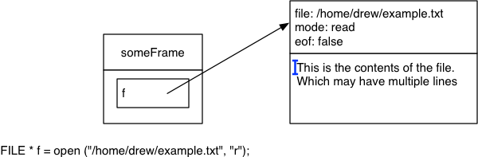

| Mode | Read and/or write | Does not exist? | Truncate? | Position  |
| :--: | :---------------: | :-------------: | :-------: | :-------: |
|  r+  |    read/write     |      fails      |    no     | beginning |
|  w   |    write only     |     created     |    yes    | beginning |
|  w+  |    read/write     |     created     |    yes    | beginning |
|  a   |      writing      |     created     |    no     |    end    |
|  a+  |    read/write     |     created     |    no     |    end    |

- if fopen fail: return NULL
  
#### Reading a File

- **fgetc**: `int fgetc(FILE * stream);`
  read one character at a time. (return int, not char)
  
  ```c
  FILE * f = fopen(inputfilename, "r");
  if (f == NULL) { /* error handling code omitted */ }
  int c;
  while ( (c=fgetc(f)) != EOF ) {
    printf("%c",c);
  }
  ```

- **fgets**: `char * fgets(char * str, int size, FILE * stream);`
  read one line (w/ a maximum length) at a time.
  ```c
  #define LINE_SIZE 5
  int main(int argc, char ** argv)
  {
    if (argc != 2) { /* omitted */ }
    FILE * f = fopen(argv[1], "r");
    if (f == NULL) { /* ommitted */ }
    long total = 0;
    char line[LINE_SIZE];
    while (fgets(line, LINE_SIZE, f) != NULL)
    {
      if (strchr(line, '\n') == NULL)
      {
        printf("LINE is too long!\n");
        return EXIT_FAILURE;
      }
      total += atoi(line);
    }
    printf("The total is %ld\n", total);
    return EXIT_SUCCESS;
  }
  ```

- **fread**: `size_t fread (void * ptr, size_t size, size_t nitems, FILE * stream);`
  read non-textual data from a file.
  - **str**: pointer to the data to write (void *: could be any type of data)
  - **size**: size of each item.
  - **nitems**: how many items should be read.
  - **stream**: which stream to read.
  - return: how many items were successfully read.

- **fscanf, sscanf** 

#### Writing Files

- **fprintf**: `int fprintf(FILE *stream, const char *format, ...)
  behaves the same as the printf function, except that it takes an additional argument (before its other arguments), which is a FILE * specifying where to write the output.
  ```c
  int main(int argc, char ** argv)
  {
    if (argc != 4) { /* omitted */ };
    int start = atoi(argv[1]);
    int end   = atoi(argv[2]);
    FILE * f = fopen(argv[3], "w");
    if (f == NULL) { /* omitted */ };

    for (int i = strt; i <= end; i++)
    {
      fprintf(f, "%d\n", i*i);
    }

    if (fclose(f) != 0) { /* omitted */ };
    return EXIT_SUCCESS;    
  }
  ```

- **fputc**: write a single character at a time
 
- **fputs**: write a string without any format conversions

- **fwrite**: `size_t fwrite(const void * ptr, size_t size, size_t nitems, FILE * stream);`
print non-textual data

#### Closing Files

- **fclose**: `int fclose(FILE * stream);`
  takes one argument, specifying which stream to close.
  - return: 
    - 0: success
    - EOF: failure (errno is set accordingly)
    Failure of fclose for a file you have been writing to is a serious situation—it means that the data your program has tried to write may be lost. 
      > always check the return of fclose


---
### Dynamic Allocation

Dynamic memory allocation allows a programmer to request a specific amount memory to be allocated on the heap (highlighted in purple in the figure below)—not the stack. Because the memory is not in the stack frame, it is not freed when the function returns. Instead, the programmer must explicitly free the memory when she is done using it.

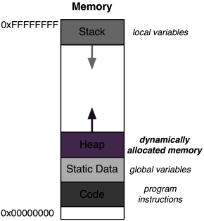

- **malloc**: allocating memory
- **free**: freeing memory when no longer need it
- **realloc**: reallocate a block of memory at a different size
- (**getline**): reading strings of arbitrary length using dynamic allocation.

#### malloc
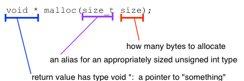

```c
int * intArray(int howLarge)
{
  int * array = malloc(howLarge * sizeof(*array));
  // malloc: Allocates memory (draw a new box)
  // - in the heap (not in any stack frame)
  //   (not disappear after return)
  // - Does not have its own name
  if (array != NULL)
  {
    for (int i = 0; i < howLarge; i++)
      array[i] = i;
  }
  return array;
}
```
Note that in this function, if malloc fails (i.e., returns NULL), then the function returns NULL—this pushes the task of handling the error up to whoever called this function. 


##### More complex structure
```c
struct point_tag {
  int x;
  int y;
};
typedef struct point_tag point_t;

struct polygon_tag {
  size_t num_points;
  point_t * points;
};
typedef struct polygon_tag polygon_t;
 	
polygon_t * makeRectangle(point_t c1, point_t c2) {
  polygon_t * answer = malloc(sizeof(*answer));
  answer->num_points = 4;
  answer->points = malloc(answer->num_points * sizeof(*answer->points));
  answer->points[0]   = c1;
  answer->points[1].x = c1.x;
  answer->points[1].y = c2.y;
  answer->points[2]   = c2;
  answer->points[3].x = c2.x;
  answer->points[3].y = c1.y;
  return answer;
}
```
- Shallow vs. Deep copying
  - ```c
    polygon_t * p2 = p1;   //just copy pointer`
    ```
    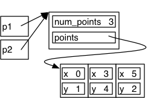 

  - Shallow copy
    ```c
    polygon_t * p2 = malloc(sizeof(*p2));
    *p2 = *p1;
    ```
    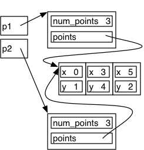 
  - Deep copy
    ```c
    polygon_t * p2 = malloc(sizeof(*p2));
    p2->num_points = p1->num_points;
    p2->points = malloc(p2->num_points * sizeof(*p2->points));
    for (size_t i = 0; i < p2->num_points; i++) {
      p2->points[i] = p1->points[i];
    }
    ```
    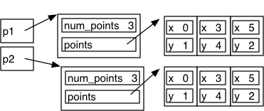

#### free
Unlike memory allocated on the stack (which is freed as soon as the function associated with that stack frame returns), memory on the heap must be explicitly freed by the programmer.

If that memory block contains other pointers to other blocks in the heap, and you are done with that memory too, you should free those memory blocks before you free the memory block containing those pointers.
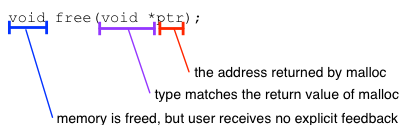
```c
polygon_t * p = makeRectangle(c1, c2);
//stuff that uses p
//...
//done with p and its points
free(p->points);  // need to free(p->points) first
free(p);          // if free(p) and then free(p->poitns)
                  // p would be dangling at the second call
```

##### Memory Leak
When you lose all references to a block of memory (that is, no pointers point at it), and the memory is still allocated, you have leaked memory

When you write a program, you should run it in valgrind, and be sure you get the following message at the end: `All heap blocks were freed -- no leaks are possible`

```c
int main(void)
{
  int x = 0;
  for (int i = 10; i < 100; i++)
  {
    int * p = malloc(i * sizeof(*p)); 
    x = doSomeCOmputation(x, i, p);
  }
  printf("Answer %d\n", x);
  return EXIT_SUCCESS;
}
```
At the end of iteration of for loop, the variable p would no longer exist. So when return the begining of for loop, p goes away, which also means lost of pointer to the memory on the heap. This memory now leaked.
Then going to next iteration, and more memory are leaked.

```c
int main(void)
{
  int x = 0;
  for (int i = 10; i < 100; i++)
  {
    int * p = malloc(i * sizeof(*p)); 
    x = doSomeCOmputation(x, i, p);
    free(p);   // free the memory before the end of the loop
  }
  printf("Answer %d\n", x);
  return EXIT_SUCCESS;
}
```

##### Three common problems when using free
- Double Free
  ```c
  int * p = malloc(4 * sizeof(*p));
  int * q = p;
  ...
  free(p);
  ...
  free(q);  // free the same memory twice
            // will result undefined behavior
  ```
- Free Memory Not in the Heap
  ```c
  int x = 3;
  int * p = &x; // p is on the stack, not heap
  ...
  free(p);      // it's illegal
                // will result in earlly termination of the program
  ```
- Free Middle of Block
  ```c
  int * p = malloc(4 * sizeof(*p));
  ...
  p++;      // increment p, so p is not point to 0th element but 1st
  ...
  free(p);  // free something not using an address returned by malloc
            // it's illegal
  ```

#### realloc
The proper way to respond to increased space needs is to use realloc.
> realloc = malloc + copy + free
> realloc **may** re-use same space

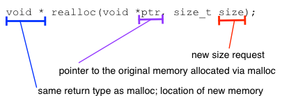

```c
int main(void)
{
  int * p = malloc(10 * sizeof(*p));
  initValues(p);
  p = realloc(p, 14 * sizeof(*p));
  intMoreValue(p);
  p = realloc(p, 4 * sizeof(*p));
  ...
  return EXIT_SUCCESS; 
}
```

#### getline
getline is a C function available in the C Standard I/O Library (#include <stdio.h>)
read a string of any length


##### Reading a File with getline
```c
int main(void)
{
  size_t sz = 0;      // how large the buffer is
  ssize_t len = 0;    // how long the actual string is  
  char * line = NULL;
  FILE * f = fopen("names.txt", "r");
  while ((len = getline(&line, &sz, f)) >= 0)
  {
    printf("%s", line);
  }
  free(line);
  return EXIT_SUCCESS;
}
// content of the names.txt
// Eva
// Georg
// Arundhati
```
getline's 4 primary tasks
- allocagte memory
  (1) the buffer we have is null, so getline will allocate space on the heap
  (5) line already point to something, don't allocate more memory
  (9) doesn't need to allocate memory
  (16) doesn't need to allocate memory
- update size
  (2) update the size variable
  (6) don't need to update size
  (10) doesn't need to update size
  (17) x update size
- read into string (Might realloc!)
  (3) read the line and store the string, will read in word as well as the \n and \0 
  (7) read a lien from the file into string, overwrote the original buffer because we fave getline the same buffer
  (11) read into the string, but the buffer has insufficient size to read the whole line (Arundhati)
  (12) allocate a longer buffer, copy the existing data, free the old buffer
  (13) update line to point at the new buffer and update size
  (14) continue reading into the string
  (18) read into the string, and reach EOF
- return len
  (4) return the length of the string
  (8) return the length of the new string into the calling function 
  (15) return the length
  (19) return -1

##### Combining getline and realloc
```c
int main(void)
{
  char ** lines = NULL;
  char * curr = NULL;
  size_t sz;
  ssize_t i = 0;
  while (getline(&curr, &sz, stdin) >= 0)
  {
    lines = realloc(lines,
                    (i + 1) * sizeof(*lines));
    lines[i] = curr;
    curr = NULL;
    i++;
  }
  free(curr);
  sort(lines, i);
  for (size_t j = 0; j < i; j++)
  {
    printf("%s", lines[j]);
    free(lines[j]);
  }
  free(lines);
  return EXIT_SUCESS;
}
```

#### valgrind
valgrinding prgorm:
`valgrind ./myProgram arg1 arg2`

you should compile with debugging information in your program (pass the -g or -ggdb3 options to gcc).

Note that Valgrind does not "play nice" with code that has been compiled with -fsanitize=address, so you should compile without that option to valgrind your code.

##### Memcheck
default tool of valgrind

##### Uninitialized Values
```
==12241== Conditional jump or move depends on uninitialised value(s)
==12241==    at 0x4E8158E: vfprintf (vfprintf.c:1660)
==12241==    by 0x4E8B498: printf (printf.c:33)
==12241==    by 0x400556: f (uninit.c:7)
==12241==    by 0x400580: main (uninit.c:15)
```

- `valgrind --track-origins=yes ./myProgram`
  report where the uninitialized value was created when it reports the error

Valgrind's Memcheck can tell us about the use of uninitialized values. However, these errors are limit to certain uses.
- if x is uninitizlized, and do y = x, Memcheck will not report the error

##### Invlaid Reads and Writes
```
==24640== Invalid read of size 4
==24640==    at 0x40060C: main (dangling.c:16)
==24640==  Address 0xfff000340 is just below the stack ptr.
```
Memcheck is telling us that we tried to read 4 bytes from an invalid (currently unallocated) memory location. It gives us a call stack trace for where the invalid read occurred

- `-fsanitize=address` 
  forces extra unused locations between variables and marks them unreadable with the validity bits it uses.

##### Valgrind with GDB
Run GDB and Valgrind together, and have Valgrind tell GDB when it encounters an error, giving control to GDB.
`--vgdb=full --vgdb-error=0`

**monitor commands:**
The combination of Valgrind and GDB is quite powerful and gives you the ability to run some new commands
```
gdb) monitor who_points_at 0x51fc040
==24303== Searching for pointers to 0x51fc040
==24303== *0xfff000450 points at 0x51fc040
==24303==  Location 0xfff000450 is 0 bytes inside local var "p"
==24303==  declared at example.c:6, in frame #0 of thread 1
```

##### Dynamic Allocation Issues
```==5465== Invalid write of size 4
==5465==    at 0x40054B: main (outOfBounds.c:8)
==5465==  Address 0x51fc044 is 0 bytes after a block of size 4 alloc'd
==5465==    at 0x4C2AB80: malloc (in /usr/lib/valgrind/vgpreload_memcheck-amd64-linux.so)
==5465==    by 0x40053E: main (outOfBounds.c:7)
```
The error first tells us the problem (we made an invalid write of 4 bytes), with a stack trace indicating where that invalid write happened (in main, on line 8 of the file outOfBounds.c). The second part tells us what invalid address our program tried to access and the nearest valid location.

- `--leak-check=full`
  Memcheck will report the location of each allocation which was not freed

##### memcheck.h
Sometimes we may want to interact with Valgrind's tools directly in our program. **memcheck.h** contains a variety of macros for exactly this purpose.

```c
void f(int x) {
  int y;
  int z = x + y;
  VALGRIND_CHECK_MEM_IS_DEFINED(&z,sizeof(z)); // 
  printf("%d\n", z);
}
```
When we run this program in valgrind, we get the error message more immediately:
```
==12425== Uninitialised byte(s) found during client check request
==12425==    at 0x4007C9: f (uninit4.c:8)
==12425==    by 0x400811: main (uninit4.c:17)
==12425==  Address 0xfff000410 is on thread 1's stack
==12425==  Uninitialised value was created by a stack allocation
==12425==    at 0x400765: f (uninit4.c:5)
```

##### Other Valgrind Tools
- **Helgrind**: designed to check for a variety of errors related to multi-threaded programming
- **Callgrind**: gives information about the performance characteristics of a program based on Valgrind’s simulation of hardware resources as it executes the program
- **Massif**: profiles the dynamic memory allocations in the heap, and gives information about how much memory is allocated at any given time and where in the code the memory was allocated.

